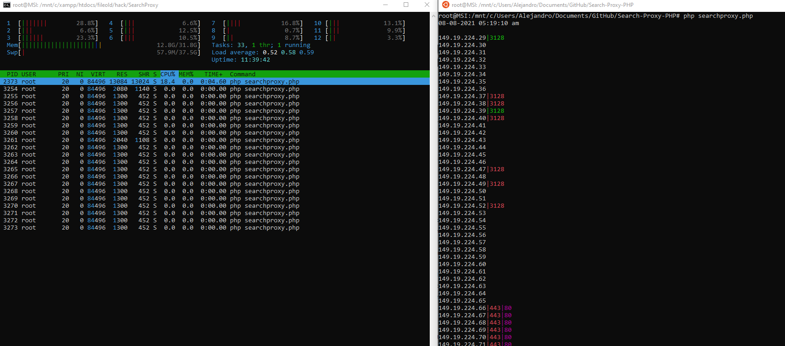

# Search Proxy


Utiliza forks, Mysql, la configuracion se encuentra en el archivo llamado { conf.php }


Ejemplo  de ejecucion :    `php searchproxy.php 149.19.224.28 149.19.224.50`


### Color de puertos
```sh
Color      Descripcion
Verde   : El puerto esta funcionando como un proxy
Rojo	: El puerto esta abierto pero no es un proxy
Morado	: El puerto contesta la peticion de google pero  no retorna el html de google, conclusion no es un proxy que se pueda usar
```
